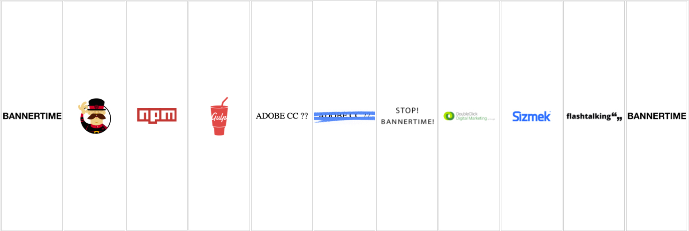

# Bannertime Developer Test 2019
# Introduction

The purpose of this test is to familiarise a candidate with a few concepts used in Bannertime, Greensock and general Animation for the Web.

The task below simulates a typical production brief.

## Task

Create a 160x600 (Width x Height) banner from the existing 300x250 banner.

Here is a storyboard of how the banner should look.



You should not overwrite the existing banner but create a copy that you can adapt to the correct size.

There is no time limit to the test but please try and keep a note of how long you spend on it.
You also do not need to complete the task to hand-in this test.

## Getting Started

### Creating a Fork

In order to use this [repo](https://confluence.atlassian.com/bitbucket/repositories-675385631.html) please [fork](https://confluence.atlassian.com/bitbucket/forking-a-repository-221449527.html) it by using the following instructions.

* 1) Click the + icon on the side bar on the right
* 2) Click on [Fork this repository](https://bitbucket.org/jf-cdp/bannertime-developer-test-2019/fork)

### Installing Dependencies

Provided that your node environment has already been setup, you would need to install the dependencies and then run gulp.

```
$ npm install
// This will install all the dependency modules needed to run the repo
```

```
$ gulp
// This will start a local server for you to use to develop
```

### Creating a commit and pushing your work

Once you are ready to hand-in your work, you will need to create a [commit and push](https://confluence.atlassian.com/bitbucketserver062/commit-and-push-changes-to-bitbucket-server-969536562.html) the work back up to your own forked repo and then [add users](https://confluence.atlassian.com/bitbucketserver/using-repository-permissions-776639771.html); **dev-kp** and **joe_midi** so that the test can be assessed. 

## Working with bannertime

### Setup - Install Gulp Yeoman and Bannertime:
[Node.js](https://nodejs.org/en/) To install Node.js we don’t use the standard installer, instead we use nvm a [Node Version Manager](https://github.com/nvm-sh/nvm), which allows you to switch between Node versions depending on the project.

```bash
curl -o- https://raw.githubusercontent.com/nvm-sh/nvm/v0.34.0/install.sh | bash
```

On OS X, if you get `nvm: command not found` after running the install script, one of the following might be the reason:-

  - your system may not have a [`.bash_profile file`] where the command is set up. Simply create one with `touch ~/.bash_profile` and run the install script again
  - you might need to restart your terminal instance. Try opening a new tab/window in your terminal and retry.


[Gulp](http://gulpjs.com/) Our prefered task runner is Gulp, we use this to automate processes such as compiling SASS into CSS, checking our Javascript files for syntax errors and minifying our image files.
```bash
npm install --global gulp
```

[Yeoman](http://yeoman.io/) helps you to kickstart new projects, prescribing best practices and tools to help you stay productive, at the moment we only really use Yeoman for Bannertime.
```bash
npm install --global yo
```

[Bannertime](https://github.com/pyramidium/generator-bannertime) is a yeoman generator we built in-house to help with the creation of banners. It provides you with some of the best practises for creating HTML5 banners, and we currently use it on all our campaign projects.
```bash
npm install --global generator-bannertime
```

These three commands can be combined into:
```bash
npm i gulp yo generator-bannertime
```

## Quick Start:

### clone the repo
`$ git clone git@bitbucket.org:username/bannertime-developer-test-2019.git

### CD into the project folder
`$ cd bannertime-developer-test-2019/`

### Install dependencies npm
`$ npm i`

### Run Gulp
`$ gulp`

### Copy existing banner
`$ yo bannertime:copy`

## Notes:
It is important to check out [www.greensock.com/gsap](https://greensock.com/gsap) to get an understanding of how the GSAP animation library works. 

* scale: - Allows you to change the size of object.
* x: Horizontal plane
* y: Vertical plane

## Usage

Use `gulp` to automatically launch the banner into the browser with browsersync all your changes will be reflected in the browser with each file save.

Use `gulp prod` to generate a ZIP file of all the assets of the banner, these will all have been minified as well.

Use `gulp backup-gen` to automatically generate backup images for each banner.

### Creating Elements

You can create DOM elements using the the `smartObject` function, this will initialise a `<div>` with the default style of: `position: absolute; top: 0; left: 0;`.

You are able to set a background image, or set a nested image as a `` element.

There are helper functions such as `center`, `centerHorizontal` and `centerVertical` to help you position the element.

Other settings are set using a helper function on the element which uses GSAP to process. So `this.logo.set({autoAlpha: 0, scale: 0.4});` is the same as `TweenLite.set(this.logo, {autoAlpha: 0, scale: 0.4});`

### Animating

The banner animation is run by the `animate` function.

By default we are using TweenLite with TimelineLite, but you can change which flavour of GSAP as you require.

For more information about animating using GSAP head to [www.greensock.com](http://www.greensock.com)